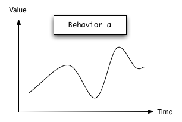

% Haskell FRP in the browser
% Gregor Riegler
% Lambdaheads --  Nov 11, 2015

# Functional Reactive Programming

## FRP is...

* 'spread-sheet'-like programming

* used for GUIs, robotics, music...

* about datatypes that represent 'a value over time'
       + 'somehow compose them' to wire your GUI components

. . . 
 
$\Rightarrow$ _no need for mutation, handlers, callbacks_

## Event


. . .

e.g. a Mouse click :: Event ()

## Behavior



. . .

e.g. the content of an input field :: Behavior String

## FRP Frameworks 1/2

* GHC: Threepenny-gui
      + uses FRP library 'reactive-banana'
      + uses the web browser as a display $\Rightarrow$ all 'logic' is done in the server process
      + alternative to desktop applications built with native toolkits

## FRP Frameworks 2/2

* GHCJS: Reflex-DOM
      + GUI 'logic' is compiled to JavaScript
      + = web binding for FRP library 'reflex'
      + alternative to typical JavaScript MVC Frameworks

# Threepenny-gui

## No-FRP Example

```
document.getElementById("displayInput").value = "Not set";

function buttonClicked() {
   var content = document.getElementById("sourceInput").value;
   document.getElementById("displayInput").value = content;
}
```

```
<input id="sourceInput" type="text" />
<button onclick="buttonClicked()">Click me</button>
<input id="displayInput" type="text" />
```

<input id="name" type="text" />
<button onclick="buttonClicked()">Click me</button>
<input id="value" type="text" />


<script language="javascript">
document.getElementById("value").value = "Not set";
function buttonClicked() {
   var content = document.getElementById("name").value;
   document.getElementById("value").value = content;
}
</script>


## FRP Thinking 1/3

* `bSource :: Behavior String`
       + the content of the sourceInput
* `eClick :: Event ()`
       + the button gets clicked
* `bDisplay :: Behavior String`
       + must be composed from the above
 

## FRP Thinking 2/3

* `bSource :: Behavior String, eClick :: Event ()`
* `bDisplay :: Behavior String`
       + It should contain "Not Set" at first
       + When _eClick_ occurs it should have the value of _bSource_
* $\Rightarrow$ find the appropriate combinators for expression that in [the documentation](http://hackage.haskell.org/package/threepenny-gui-0.6.0.3/docs/Reactive-Threepenny.html)
 
## FRP Thinking 3/3

```
bSource :: Behavior String
eClick :: Event ()
```

```
-- Combinators we find in Reactive.Threepenny
stepper :: MonadIO m => a -> Event a -> m (Behavior a)
(<@) :: Behavior a -> Event b -> Event a
```

```
-- Our solution
bDisplay = stepper "Not Set" (bSource <@ eClick)

-- Make displayInput show bDisplay
```

## Threepenny Example

```
app :: Window -> UI ()
app w = void $ do
  rec sourceInput <- UI.input
      displayInput <- UI.input
      clickBtn   <- UI.button #+ [ string "Click Me" ]

      let eClick :: Event () = UI.click clickBtn
      sourceB  <- stepper ""  . UI.valueChange $ sourceInput
      displayB <- stepper "Not Set" (sourceB <@ eClick)

      element displayInput # sink value displayB

  getBody w # set children [getElement sourceInput, getElement clickBtn
                          , getElement displayInput]
```

## Combinators
```
accumB :: MonadIO m => a -> Event (a -> a) -> m (Behavior a)
accumE :: MonadIO m => a -> Event (a -> a) -> m (Event a)
unions :: [Event a] -> Event [a]
apply :: Behavior (a -> b) -> Event a -> Event b 
stepper :: MonadIO m => a -> Event a -> m (Behavior a)
unionWith :: (a -> a -> a) -> Event a -> Event a -> Event a
```
... a few more (see the [the documentation](http://hackage.haskell.org/package/threepenny-gui-0.6.0.3/docs/Reactive-Threepenny.html))

## Threepenny CRUD


## Threepenny CRUD

```
type Key = Int
type Names = (String,String)
type Database = Map Key Names

let bDatabase :: Behavior Database
    bDatabase = accumB' empty solution
    solution :: [Event (Database -> Database)]
    solution = [ _createName, _updateName, _deleteName ]
```

. . . 

```
eCreate :: Event ()
eDelete :: Event ()
eNames  :: Event Names
bSelection :: Behavior (Maybe Key)

create :: Names -> Database -> Database
update :: Maybe Key -> Names -> Maybe (Database -> Database) 
delete :: Key -> Database -> Database

filterJust :: Event (Maybe a) -> Event a
(<@) :: Behavior a -> Event b -> Event a
(<@>) :: Behavior (a -> b) -> Event a -> Event b
```

## CRUD createName 1/2

```
createName :: Event (Database -> Database)
createName = ???
```

. . .

```
eCreate :: Event ()

emil = ("Emil,"Example") :: Names
create :: Names -> Database -> Database
const :: a -> b -> a
fmap :: (a -> b) -> Event a -> Event b
```

## CRUD createName 2/2

```
eCreate :: Event ()

emil = ("Emil,"Example") :: Names
create :: Names -> Database -> Database
const :: a -> b -> a
fmap :: (a -> b) -> Event a -> Event b
```

```
createEmil :: Database -> Database
createEmil = create emil
```

. . .

```
constCreateEmil :: () -> (Database -> Database)
constCreateEmil = const createEmil
```

. . .

```
createName :: Event (Database -> Database)
createName = fmap constCreateEmil eCreate
```

. . .

```
-- More succinct:
createName = create ("Emil","Example") <$ eCreate
```

## CRUD deleteName 1/2

```
deleteName :: Event (Database -> Database)
deleteName = ???
```

. . .

```
eDelete :: Event ()
bSelection :: Behavior (Maybe Key)

delete :: Key -> Database -> Database
fmap :: (a -> b) -> Event a -> Event b

(<@) :: Behavior a -> Event b -> Event a
filterJust :: Event (Maybe a) -> Event a
```

## CRUD deleteName 2/2

```
eDelete :: Event ()
bSelection :: Behavior (Maybe Key)

delete :: Key -> Database -> Database
fmap :: (a -> b) -> Event a -> Event b

(<@) :: Behavior a -> Event b -> Event a
filterJust :: Event (Maybe a) -> Event a
```

. . .

```
bSelectionOnDelete :: Event (Maybe Key)
bSelectionOnDelete = bSelection <@ eDelete
```

. . . 

```
bKeyOnDelete :: Event Key
bKeyOnDelete = filterJust bSelectionOnDelete
```

. . .

```
deleteName :: Event (Database -> Database)
deleteName = fmap delete bKeyOnDelete
```


## Threepenny summary

* Nice API
      + Event/Behavior composing functions have nice types,
        well-documented and are in [one module](http://hackage.haskell.org/package/threepenny-gui-0.6.0.3/docs/Reactive-Threepenny.html))
        + _Event_ and _Behavior_ are Applicative and Functor instances
* Learn how use it by analyzing the examples in the [samples directory](https://github.com/HeinrichApfelmus/threepenny-gui/tree/master/samples)
* Unfortunately, no "production-ready" binding for GHCJS yet ([Francium](https://github.com/ocharles/Francium) the only project I found)


# GHCJS

## What is GHCJS

* Haskell to JavaScript compiler, based on GHC
* has become increasingly popular, lately
* build/dependency management not yet on par with GHC

## Using Reflex with GHCJS

* There is a
  [repo of the Reflex author](https://github.com/ryantrinkle/try-reflex)
  which provides a GHCJS environment with the Reflex library in a Nix sandbox

* For build/dependency management of GHC projects there is
  [stack](https://github.com/commercialhaskell/stack/). **Does stack
  support GHCJS?**

## Not yet

* However, it is in development and can already be used experimentally providing even
a GHCJS interpreter 
      + is explained in [https://github.com/luigy/try-stack-reflex](https://github.com/luigy/try-stack-reflex)
```
stack upgrade --git
./try-stack-reflex ghcjsi   # takes a long time! 
stack ghci                  # Voilà!
```

. . .

* or wait for a few months until *stack* fully supports GHCJS

. . .

$\Rightarrow$ Using GHC/GHCJS in a single project is going to be "magical"!


# Reflex

## Reflex libraries

* [reflex](http://hackage.haskell.org/package/reflex) is the basic FRP library
       + uses a *Dynamic* type which wraps a *Behavior* and an *Event* of its changes
       + combinators in [Reflex.Class](https://hackage.haskell.org/package/reflex-0.3/docs/Reflex-Class.html) and [Reflex.Dynamic](https://hackage.haskell.org/package/reflex-0.3/docs/Reflex-Dynamic.html)
* [reflex-dom](http://hackage.haskell.org/package/reflex-dom) is the web binding for it

## Reflex example

```
app = do
  sourceInput <- textInput def

  rec let config = def { _textInputConfig_initialValue = "Not Set" }
                       & setValue .~ (updated dDisplay)
      displayInput <- textInput config
      dDisplay <- holdDyn "" eContentWhenClicked

      eClick <- button "Click Me"

      let bSource = current $ _textInput_value sourceInput
          eContentWhenClicked = tag bSource eClick 
  return ()
```
```
current :: Dynamic t a -> Behavior t a 
updated :: Dynamic t a -> Event t a 
tag :: Reflex t => Behavior t b -> Event t a -> Event t b 
holdDyn :: MonadHold t m => a -> Event t a -> m (Dynamic t a) 
```

## More combinators
```
mapDyn :: (Reflex t, MonadHold t m) =>
          (a -> b) -> Dynamic t a -> m (Dynamic t b) 
foldDyn :: (Reflex t, MonadHold t m, MonadFix m) =>
          (a -> b -> b) -> b -> Event t a -> m (Dynamic t b) 
attachDynWith :: Reflex t =>
          (a -> b -> c) -> Dynamic t a -> Event t b -> Event t c 
count :: (Reflex t, MonadHold t m, MonadFix m, Num b) =>
          Event t a -> m (Dynamic t b) 
...
```

* Type signatures not as nice as comparable threepenny combinator type signatures
* _Dynamic_ is not a a Functor, so you often need _mapDyn_ $\Rightarrow$ somehow ugly

## Reflex Sudoku

[https://github.com/sleepomeno/reflex-sudoku](https://github.com/sleepomeno/reflex-sudoku)

## Cell Correctness
```
foldDyn' :: x -> [Event t (x -> x)] -> Dynamic t x

cellContentCorrect :: (Event t Correctness, Event t Digit)
                   -> Dynamic t Bool
cellContentCorrect (eCorrectness, eDigit) = ?
```
```
data Digit = Guess Int | Free Int
data Correctness = Correct | NotCorrect | NotADigit

isCorrect :: Correctness -> Bool
isNotADigit :: Correctness -> Bool
ffilter :: (a -> Bool) -> Event t a -> Event t a

eSelectedSudoku :: Event Int
```

## Solved 1/7

```
cellContentCorrect :: (Event t Correctness, Event t Digit) -> Dynamic t Bool
cellContentCorrect (eCorrectness, eDigit) = foldDyn' False [
    -- should be True when the digit is a free digit
    -- should be True when the digit cell input is correct
    -- should be False when the cell input is not a digit
    -- should be False when a new sudoku is chosen
    -- should be False when the digit cell input is incorrect
    ]
```
```
data Digit = Guess Int | Free Int
data Correctness = Correct | NotCorrect | NotADigit

isCorrect :: Correctness -> Bool
isNotADigit :: Correctness -> Bool
ffilter :: (a -> Bool) -> Event t a -> Event t a

eSelectedSudoku :: Event Int
```

## Solved 2/7

```
cellContentCorrect :: (Event t Correctness, Event t Digit) -> Dynamic t Bool
cellContentCorrect (eCorrectness, eDigit) = foldDyn' False [
      const True <$ ffilter isFree eDigit
    -- should be True when the digit cell input is correct
    -- should be False when the cell input is not a digit
    -- should be False when a new sudoku is chosen
    -- should be False when the digit cell input is incorrect
    ]
```
```
data Digit = Guess Int | Free Int
data Correctness = Correct | NotCorrect | NotADigit

isCorrect :: Correctness -> Bool
isNotADigit :: Correctness -> Bool
ffilter :: (a -> Bool) -> Event t a -> Event t a

eSelectedSudoku :: Event Int
```

## Solved 3/7

```
cellContentCorrect :: (Event t Correctness, Event t Digit) -> Dynamic t Bool
cellContentCorrect (eCorrectness, eDigit) = foldDyn' False [
      const True <$ ffilter isFree eDigit
    , const True <$ ffilter isCorrect eInput
    -- should be False when the cell input is not a digit
    -- should be False when a new sudoku is chosen
    -- should be False when the digit cell input is incorrect
    ]
```
```
data Digit = Guess Int | Free Int
data Correctness = Correct | NotCorrect | NotADigit

isCorrect :: Correctness -> Bool
isNotADigit :: Correctness -> Bool
ffilter :: (a -> Bool) -> Event t a -> Event t a

eSelectedSudoku :: Event Int
```

## Solved 4/7

```
cellContentCorrect :: (Event t Correctness, Event t Digit) -> Dynamic t Bool
cellContentCorrect (eCorrectness, eDigit) = foldDyn' False [
      const True <$ ffilter isFree eDigit
    , const True <$ ffilter isCorrect eInput
    , const False <$ ffilter isNotADigit eInput
    -- should be False when a new sudoku is chosen
    -- should be False when the digit cell input is incorrect
    ]
```
```
data Digit = Guess Int | Free Int
data Correctness = Correct | NotCorrect | NotADigit

isCorrect :: Correctness -> Bool
isNotADigit :: Correctness -> Bool
ffilter :: (a -> Bool) -> Event t a -> Event t a

eSelectedSudoku :: Event Int
```

## Solved 5/7

```
cellContentCorrect :: (Event t Correctness, Event t Digit) -> Dynamic t Bool
cellContentCorrect (eCorrectness, eDigit) = foldDyn' False [
      const True <$ ffilter isFree eDigit
    , const True <$ ffilter isCorrect eInput
    , const False <$ ffilter isNotADigit eInput
    , const False <$ eSelectedSudoku
    -- should be False when the digit cell input is incorrect
    ]
```
```
data Digit = Guess Int | Free Int
data Correctness = Correct | NotCorrect | NotADigit

isCorrect :: Correctness -> Bool
isNotADigit :: Correctness -> Bool
ffilter :: (a -> Bool) -> Event t a -> Event t a

eSelectedSudoku :: Event Int
```

## Solved 6/7

```
cellContentCorrect :: (Event t Correctness, Event t Digit) -> Dynamic t Bool
cellContentCorrect (eCorrectness, eDigit) = foldDyn' False [
      const True <$ ffilter isFree eDigit
    , const True <$ ffilter isCorrect eInput
    , const False <$ ffilter isNotADigit eInput
    , const False <$ eSelectedSudoku
    , const False <$ ffilter isNotCorrect eInput
    ]
```
```
data Digit = Guess Int | Free Int
data Correctness = Correct | NotCorrect | NotADigit

isCorrect :: Correctness -> Bool
isNotADigit :: Correctness -> Bool
ffilter :: (a -> Bool) -> Event t a -> Event t a

eSelectedSudoku :: Event Int
```

## Solved 7/7

```
cellContentCorrect :: (Event t Correctness, Event t Digit)
                   -> Dynamic t Bool
eCorrectness :: [Event t Correctness]
eDigits :: [Event t Digit]
mconcatDyn :: (Monoid a) => [Dynamic t a] -> Dynamic t a
```
. . . 

```
dCorrectCells :: [Dynamic t Monoid.All] <-
  forM (zip eCorrectness dDigits)
    (isCellInput >=> mapDyn Monoid.All) 

dSudokuSolved :: Dynamic t Bool <-
  mconcatDyn dCorrectCells >>= mapDyn Monoid.getAll

elClass "h3" "solved" $ dynText =<< forDyn dSudokuSolved $
  \isSolved -> if isSolved then "Solved!" else mempty
```

## Reflex/Threepenny conclusion

* Reflex type signatures more complex 
* Reflex documentation not on par with threepenny-gui's documentation
* Reflex adds DOM elements implicitly whereas threepenny does it explicitly
* Neither framework uses HTML markup directly (like AngularJS)


